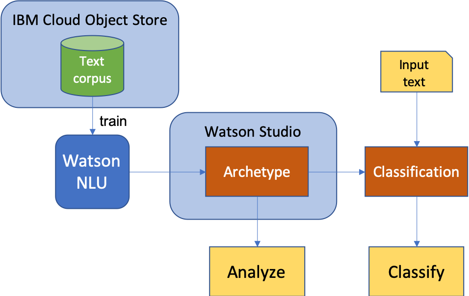

# Discover the archetypes in your system of records

System of records are ubiquitous in the world around us, ranging from github issues, job listing, customer service calls, etc.  Archetypes are formally defined as a pattern or a model, of which all things of the same type are copied.  More informally, we can think of archetypes as categories, classes, topics, etc.  

When we read through a system of records, our mind naturally groups the records into some collection of archetypes.  For example, we may sort a song collection into easy listening, classical, rock, etc.  This manual process is practical for a small system of records, for examples a few dozen.  Large system can have millions of records, so we need an automated way to processing them.  Since most records are in the form of natural text, such automated processing needs to be able to understand natural language.  Watson Natural Language Understanding coupled with statiscal techniques can help you to (1) discover useful archetypes in your records and then (2) classify new record against this set of archetypes.

In this example, we will use a medical dictation data set to illustrate the process. The data is provided by [ezDI](https://www.ezdi.com) and includes 249 actual medical dictation that have been anonymized.

When the reader has completed this code pattern, they will understand how to:

* Work with the `Watson Natural Language Understanding` service (NLU) through API calls.
* Work with the `IBM Cloud Object Store` service (COS) through the SDK to hold data and result.
* Perform statistical analysis on the result from `Watson Natural Language Understanding`.
* Explore the archetypes through graphical interpretation of the data in a Jupyter Notebook or a web interface



## Flow
1. The user downloads the custom medical dictation data set from [ezDI](https://www.ezdi.com) and prepares the text data for processing.
1. The user interacts with the Watson Natural Language Understanding service via the provided application UI or the Jupyter Notebook.
1. The user runs a series of statistical analysis on the result from Watson Natural Language Understanding.
1. The user uses the graphical display to explore the archetypes that the analysis discovers.
1. 
1. Several users can work on the same custom model at the same time.

## Included components


## Featured technologies


# Watch the Video


# Steps

## 1. Clone the repo

## 2. Create IBM Cloud services
Set up two buckets:  one for the medical dictation and one for the NLU result.   

### a. Watson Natural Language Understanding

### b. Watson Studio

### c. IBM Cloud Object Store 


## 3. Download and prepare the data

Go to the [ezDI](https://www.ezdi.com/open-datasets/) web site and download both the medical dictation audio files and the transcribed text files. The downloaded files will be contained in zip files.

Create both an `Audio` and `Documents` subdirectory inside the `data` directory and then extract the downloaded zip files into their respective locations.

The transcription files stored in the `Documents` directory will be in **rtf** format, and need to be converted to plain text. Use the following bash script to convert them all to **txt** files.

> Note: Run the following script with Python 2.7.

```bash
pip install pyth
for name in `ls Documents/*.rtf`;
do
  python convert_rtf.py $name
done
```

Upload the dictation in text format to the IBM Cloud Object Store bucket for dictation.

## 4. Configure credentials


## 5. Run the Jupyter notebook